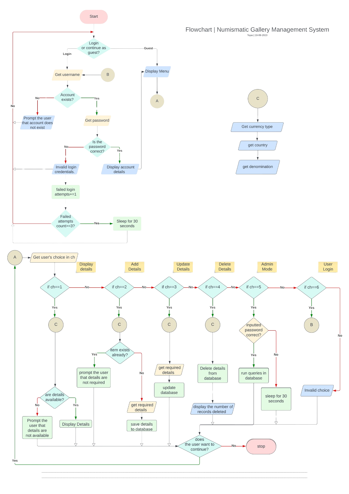
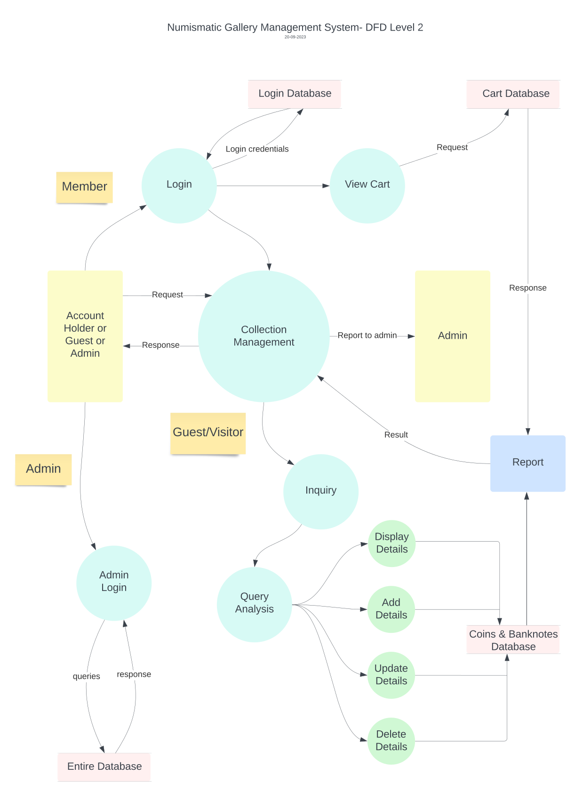

# Online Catalogue & Shop Management

Python & MySQL

## Abstract

In this project, we will try to develop an interface to facilitate the posting and fetching of information about currency which is part of our collection. The idea is to develop a program that will allow viewers of the collection to look for the currency they are interested in by entering the country it belongs to. In case the collector does not have any currency of that country, it will allow the user to add information about it from his side by filling details in fields like year, description, country, denomination and composition. In case the currency the user is looking for is present in the collection, the user will be presented with a choice whether he is looking for a coin or a banknote. Based on the user input, the interface will display all the relevant currency and the user will be able to search for a particular currency by entering its denomination. The user will be able to view the information of the currency and whether it is available for trading or not.
In this project, we will also allow the users to create customer accounts, where they can see the cart subtotal and the items, if they wish to buy currency which is available for sale. 
The essence of this project is to create a fully functional interactive collection display gallery as seen on the instagram page owned by us [@numismatic_gallery_](https://instagram.com/numismatic_gallery_)

---

## Introduction of the Numismatic Gallery Management System

We will make this project by using Python and text file handling. It will be a menu-driven program, in which we will use different user-defined functions for different actions that the user wants to perform. Some of the actions that the user will be able to perform are:
<pre>
✯ View details                          ✯ Add details
✯ Delete details                        ✯ Admin mode  
✯ User login                            ✯ Update details
✯ View Cart                             ✯ Exit
</pre>

Some of the functions that we will develop for the same purpose are as follows:

<mark>Functions developed:</mark>

***country( )***: This function will look at whether the currency of the entered country exists in the collection or not.

***add_coin( )***: This function will help the user to enter information about the currency coin that is not yet part of the collection.

***add_note( )***: This function will help the user to enter information about the currency note that is not yet part of the collection.

***delete_coin( )***: This function will help the user to delete information about the currency coin which may be incorrect.

***delete_note( )***: This function will help the user to delete information about the currency coin which may be incorrect.

***accounts( )***:  This function will help in managing the customer accounts.

---
## Literature Study of Numismatic Gallery Management System

### 1. Introduction

> **1.1 Purpose:** The purpose of this document is to build an online system to manage the collection of coins and banknotes and to ease the collection management. The users/collectors must be able to post and fetch the information about an item. Also, users can create their accounts and login to them to see the contents of their shopping cart in case they want to buy from Numismatic Gallery.

> **1.2 Intended Audience:** This project is a prototype for the collection management system and will be available worldwide. The targeted audience are the collectors of numismatic items, who can fetch information such as year of mint, composition material, availability, design, estimated value, etc. of the collectible they possess or buy the item they wish for.

> **1.3 Project scope:** The purpose of this project is to create a convenient and easy-to-use application for collectors, searching for information or trying to buy items. Above all, we hope to provide a comfortable user experience along with the best pricing available. The Numismatic Gallery Management System will allow collectors to:
- Store and manage detailed information about their coin collection.
- Securely browse their collection through a login system.
- Add desired coins to a shopping cart for potential purchase.
- Complete transactions through the integrated shop feature.

> **1.4 References:** The reference for user interface for this software may be taken from the websites:
 [Home Page](https://multiverseweb.github.io/coinshop/) and  [Login Window](https://multiverseweb.github.io/login/) .

> **1.5  Definitions, Acronyms, and Abbreviations:**
- Python: The programming language used for software development.
- File Handling: The database management system used for data storage.
- SRS: Software Requirement Specification.

### 2. Overall Description

> **2.1 Product Perspective:** The Coin Collector Database Management System is a standalone web-based application. It interfaces with a text file database to store and retrieve coin collection and shopping cart data. The project database system stores the following information:
Item Details: It includes the information of collectibles that are already available for sale and users can fetch the information about these items or can buy them too.
Customer Details: It includes the customer account details such as customer name, password and items in cart.

> **2.2 Product Features:**
>> *2.2.1 User Authentication:*
- Users can register using their name and password.
- Secure login mechanism for accessing the system.
>> *2.2.2 Coin Collection Management:*
- Users can add, edit, and delete coin entries.
- Each coin entry includes details such as coin name, year, country, condition, and description.
- Organise collections based on attributes (e.g., year, country, condition).
>> *2.2.3 Shopping Cart Management:*
- Users can add and manage items in their shopping cart.
- Cart contents can be reviewed and modified.
- Users can complete purchases through the shopping cart.
>> *2.2.4 Shop:*
- Displays available coins for sale.
- Listings include coin name, year, country of origin, price, and availability.
>> **2.3 User Classes and Characteristics:**
- Collectors: Registered users who can manage their coin collections and make purchases.
- Admin: System administrators responsible for managing user accounts and shop listings.

> **2.4 Operating Environment:** The operating environment for the system is as follows:
 - Distributed Database	
 - Client/Server system
 - Operating System: Windows 
 - Database: MySQL
 - Backend: Python

### 3. Functional Requirements

Detailed functional requirements are specified in Section 2.2.

### 4. Non-Functional Requirements
> **4.1 Performance Requirements:**
- The system shall provide a responsive user experience.
- Database operations should be optimised for minimal latency.
> **4.2 Security Requirements:**
- User data and transactions shall be securely encrypted.
- Authentication shall prevent unauthorised access.
- Data backup and recovery mechanisms shall be implemented.
> **4.3 Usability Requirements:**
- The user interface shall be intuitive and user-friendly.

### 5. Methodology Used
> **5.1 User Interface**
 Mobile View


Desktop View


> **5.2 Hardware Interface:**
- A browser that supports HTML, CSS and JavaScript.
> **5.3  Performance:**
- The application shall load quickly and respond to user interactions in a timely manner.
- The sky map rendering shall be smooth, even on devices with lower 
processing power.
> **5.4  Open Source:**
- This should be an open source web software in which users should be able to copy the information they want.

> **5.5 Software Interfaces:**

| Software Used | Description |
|:----------:|---:|
| Operating System| We have chosen the Windows operating system for its supporting environment and its user-friendliness. |
| Database|To save records, we have chosen MySQL Database.|
|Backend Language|We have chosen Python for its more interactive support.|

> **5.6 Communication Interface:**
 The project supports all types of web browsers and devices.

### 6. Constraints
> **6.1 Data Storage:**
Dependent on scalable databases for user accounts and interactions, adhering to privacy regulations.
> **6.2  Internet Connectivity:**
Platform requires an active internet connection for access.

### 7. Conclusion
This Software Requirement Specification (SRS) document serves as a comprehensive guide for the development of the Numismatic Gallery Management System, ensuring that all specified requirements are addressed. Detailed requirements ensure a secure, accessible, and user-friendly environment, supported by ongoing maintenance and future enhancements.

---
---

## Flowchart


## DFDs



## Conclusion

In summary, the Collection Management System, developed using Python and MySQL, seamlessly integrated with a dedicated website frontend, stands as a sophisticated solution for enthusiasts managing their coin and banknote collections. The project's strength lies in the combination of Python's flexibility for backend logic and MySQL's prowess as a relational database, fostering efficient data management.

The MySQL database serves as a robust backend, ensuring the structured storage of user account details and collection items. This relational model facilitates quick and organised retrieval, updating, and deletion of data, contributing to a smooth and responsive user experience.

The frontend, embedded within a user-friendly website, significantly elevates the accessibility and usability of the system. The graphical interface enhances user interaction, offering features such as responsive design, dynamic updates, and intuitive navigation. This not only simplifies the user experience but also opens avenues for customization, branding, and extended user engagement.

Moreover, Python's adaptability augurs well for future expansions. The system can seamlessly incorporate advanced features, such as fortified user authentication methods, detailed item descriptions, and sophisticated search functionalities. The combination of a powerful backend, a user-centric frontend, and Python's extensibility establishes a foundation that accommodates the evolving needs of collectors.

In essence, the Collection Management System, with its Python-MySQL synergy and a dedicated website frontend, transcends the basic requirements of a collection management platform. It not only caters to the fundamental functionalities but also lays the groundwork for a scalable, customizable, and immersive user experience in the ever-evolving world of collection management.

---
---

# Source Code
```python
import mysql.connector as my
import time
import getpass
import webbrowser
import warnings
warnings.filterwarnings("ignore")

C=['Country:','Denomination:','Year:','Frontside:','Backside:','Material:','Diameter:','Thickness','\t\t\t\t\t\t\t\t\t ©','\t\t\t\t\t\t\t\t\t Last updated on:']
N=['Country:','Denomination:','Year:','Frontside:','Backside:','Material:','Length:','Breadth:','Watermark:','\t\t\t\t\t\t\t\t\t ©','\t\t\t\t\t\t\t\t\t Lastupdated on:']
##############################################################################################################################3
                                                #update coin details
def update_c(col,c,v):
    if col.lower()=='country':
        new=input("Enter new country name:")
        cursor2.execute("update coin set country='{}'where country='{}' and denomination={}".format(new,c.lower(),v))
    elif col.lower()=='name':
        new=input("Enter new name:")
        cursor2.execute("update coin set name='{}'where country='{}' and denomination={}".format(new,c.lower(),v))
    elif col.lower()=='denomination':
        new=int(input("Enter new denomination:"))
        cursor2.execute("update coin set denomination={} where country='{}' and denomination={}".format(new,c.lower(),v))
    elif col.lower()=='year':
        new=input("Enter new year:")
        cursor2.execute("update coin set year='{}' where country='{}' and denomination={}".format(new,c.lower(),v))
    elif col.lower()=='front side':
        new=input("Enter new details of front side:")
        cursor2.execute("update coin set front='{}' where country='{}' and denomination={}".format(new,c.lower(),v))
    elif col.lower()=='back side':
        new=input("Enter new details of back side:")
        cursor2.execute("update coin set back='{}' where country='{}' and denomination={}".format(new,c.lower(),v))
    elif col.lower()=='material':
        new=input("Enter new material:")
        cursor2.execute("update coin set material='{}' where country='{}' and denomination={}".format(new,c.lower(),v))
    elif col.lower()=='diameter':
        new=input("Enter new diameter: ")
        cursor2.execute("update coin set diameter='{}' where country='{}' and denomination={}".format(new,c.lower(),v))
    elif col.lower()=='thickness':
        new=input("Enter new thickness:")
        cursor2.execute("update coin set thickness='{}' where country='{}' and denomination={}".format(new,c.lower(),v))
    else:
        print("No such field found.")
    global A
    A=False
    mycon2.commit()
##############################################################################################################################
                                                #update note details
def update_n(col,c,v):
    if col.lower()=='country':
        new=input("Enter new country name:")
        cursor2.execute("update note set country='{}' where country='{}' and denomination={}".format(new,c.lower(),v))
    elif col.lower()=='name':
        new=input("Enter new name:")
        cursor2.execute("update note set name='{}' where country='{}' and denomination={}".format(new,c.lower(),v))

    elif col.lower()=='denomination':
        new=int(input("Enter new denomination:"))
        cursor2.execute("update note set denomination={} where country='{}' and denomination={}".format(new,c.lower(),v))
    elif col.lower()=='year':
        new=input("Enter new year:")
        cursor2.execute("update note set year='{}' where country='{}' and denomination={}".format(new,c.lower(),v))
    elif col.lower()=='front side':
        new=input("Enter new details of front side:")
        cursor2.execute("update note set front='{}' where country='{}' and denomination={}".format(new,c.lower(),v))
    elif col.lower()=='back side':
        new=input("Enter new details of back side:")
        cursor2.execute("update note set back='{}' where country='{}' and denomination={}".format(new,c.lower(),v))
    elif col.lower()=='material':
        new=input("Enter new material:")
        cursor2.execute("update note set material='{}' where country='{}' and denomination={}".format(new,c.lower(),v))
    elif col.lower()=='length':
        new=input("Enter new length: ")
        cursor2.execute("update note set length='{}' where country='{}' and denomination={}".format(new,c.lower(),v))
    elif col.lower()=='breadth':
        new=input("Enter new breadth:")
        cursor2.execute("update note set breadth='{}' where country='{}' and denomination={}".format(new,c.lower(),v))
    elif col.lower()=='watermark':
        new=input("Enter new watermark:")
        cursor2.execute("update note set watermark='{}' where country='{}' and denomination={}".format(new,c.lower(),v))
    else:
        print("No such field found.")
    global A
    A=False
    mycon2.commit()
#######################################################
def addc(c): #adding coin details
    print("\nNOTE: If any field is unknown then please enter 'na'.")
    n=input("Enter your name: ")
    v=int(input("Denomination:"))
    cu2=str(input("Currency name: "))
    y=str(input("Year of issue: "))
    f=input("Design on front side:")
    b=input("Design on back side: ")
    e=input("Material: ")
    print("Dimensions↴")
    l=input("Diameter: ")
    s=input("Thickness: ")
    ti=str(time.strftime('%d-%m-%y'))
    mycon=my.connect(host='localhost',user='root',passwd='tejas123',database='numis')
    cursor=mycon.cursor()
    q3="insert into coin values('{}',{},'{}','{}','{}','{}','{}','{}','{}','{}')".format(c,v,y,f,b,e,l,s,n,ti)
    cursor.execute(q3)
    mycon.commit()
    print("Thanks for helping!! :D")
    mycon.close()
    q5="insert into currency values('{}','{}')".format(c,cu2)
    cursor2.execute(q5)
    mycon2.commit()
    print(131*"=")
#############################################################################################################################
def addn(c):                                        #adding note details
    print("\nNOTE: If any field is unknown then please enter 'na'.")
    n=input("Enter your name: ")
    v=int(input("Denomination: "))
    cu2=input("Currency name: ")
    y=str(input("Year of issue: "))
    f=input("Design on front side: ")
    b=input("Design on back side: ")
    e=input("Material: ")
    print("Dimensions↴")
    l=input("Length: ")
    s=input("Breadth: ")
    w=input("Watermark: ")
    ti=str(time.strftime('%d-%m-%y'))
    mycon=my.connect(host='localhost',user='root',passwd='tejas123',database='numis')
    cursor=mycon.cursor()
    q4="insert into note values('{}',{},'{}','{}','{}','{}','{}','{}','{}','{}','{}')".format(c,v,y,f,b,e,l,s,w,n,ti)
    cursor.execute(q4)
    mycon.commit()
    print("Thanks for helping!! :D")
    mycon.close()
    q5="insert into currency values('{}','{}')".format(c,cu2)
    cursor2.execute(q5)
    mycon2.commit()
    print(131*"=")
#############################################################################################################################
def country(c):
    mycon=my.connect(host='localhost',user='root',passwd='tejas123',database='numis')
    cursor=mycon.cursor()
    t=input("Do you want to know about coin or note?(c/n):")
    if t.lower()=="c":
        q="select denomination from coin where country='{}' order by denomination".format(c,)
        cursor.execute(q)
        data=cursor.fetchall()
        if len(data)!=0:
            print("The available coins of",c.title(),"are:")             #if type= coin
            for i in range(0,len(data)):
                print(data[i][0])
            print("NOTE: If you want to add information about a coin which is not mentioned above,\nthen enter that denomination.")
            v=int(input("Choose the denomination: "))
            print("\n")
            q2="select * from coin where country='{}' and denomination={}".format(c.lower(),v)
            cursor.execute(q2)
            data1=cursor.fetchone()
            if data1!=None:
                print(7*"\t"," DESCRIPTION")
                for i in range(len(data1)):
                    if i==6:
                        print("Dimensions↴")
                    print(C[i],str(data1[i]).capitalize())
            else:
                print("Sorry! We don't have any information about this country. :(")
                a=input("Would you like to help us know about it? (y/n):")

                if a.lower()=="n":
                    print("No problem! :)")
                elif a.lower()!="y":
                    print("Invalid reply! >:(")
                else:
                    addn(c)
        else:
            print("Sorry! We don't have any information about this country. :(")
            a=input("Would you like to help us know about it? (y/n):")

            if a.lower()=="n":
                print("No problem! :)")
            elif a.lower()!="y":
                print("Invalid reply! >:(")
            else:
                addn(c)
    elif t.lower()=='n':
        q="select denomination from note where country='{}' order by denomination".format(c,)
        cursor.execute(q)
        data=cursor.fetchall()
        if len(data)!=0:
            print("The available notes of",c.title(),"are:")
                                                                                    #if type= note
            for i in range(len(data)):
                print(data[i][0])
            print("NOTE: If you want to add information about a note which is not mentioned above,\nthen enter that denomination.")
            v=int(input("Choose the denomination:"))
            print("\n")
            q2="select * from note where country='{}' and denomination={}".format(c,v)
            cursor.execute(q2)
            data1=cursor.fetchone()
            if data1!=None:
                print(7*"\t"," DESCRIPTION")
                for i in range(len(data1)):
                    if i==6:
                        print("Dimensions↴")
                    print(N[i],str(data1[i]).capitalize())

            else:
                print("Sorry! We don't have any information about this country. :(")
                a=input("Would you like to help us know about it? (y/n):")

                if a.lower()=="n":
                    print("No problem! :)")
                elif a.lower()!="y":
                    print(" Invalid reply! >:(")
                else:
                    addn(c)

        else:
            print("Sorry! We don't have any information about this country. :(")
            a=input("Would you like to help us know about it? (y/n):")
            if a.lower()=="n":
                print("No problem! :)")
            elif a.lower()!="y":
                print("Invalid reply! >:(")
            else:
                addn(c)

    else:
        print("Invalid reply! >:(")
        mycon.close()
    print(131*"=")
    
# Function to view items in the shopping cart
def view_items(cursor,u):
    total=0
    cursor.execute("SELECT * FROM shopping_cart where username='{}'".format(u))
    items = cursor.fetchall()
    if items:
        print("Shopping Cart Items:")          
        for i in range(0,len(items)):
            print("#",items[i][0])
            total+=items[i][0]/10
        print("\nCart Value= INR ",total)
    else:
        print("Shopping cart is empty.")
# Function to add an item to the shopping cart
def add_item(cursor, item_id,u):
    try:
        q="insert into shopping_cart values({},'{}')".format(item_id,u)
        cursor.execute(q)
        print("Item added successfully.")
    except Exception as err:
        print("Error adding item :(")
    mycon.commit()
# Function to delete an item from the shopping cart
def delete_item(cursor, item_id,u):
    try:
        cursor.execute("DELETE FROM shopping_cart WHERE id = {} and username='{}'".format(item_id,u))
        print("Item deleted successfully.")
    except Exception as err:
        print("Error deleting item :(")
    mycon.commit()
# Function to buy items in the shopping cart
def buy_now(cursor):
    print("Items purchased successfully.")

####################################################################################################################################
z=0
time.sleep(1)
print(".",end="")
time.sleep(0.2)
print(".",end="")
time.sleep(0.3)
print(".\n",end="")
time.sleep(0.2)
print(131*"=","\n",44*" ","✬ WELCOME TO NUMISMATIC GALLERY! ✬ \n")
print("Numismatic Gallery is an interface to facilitate the posting and fetching of information of currency which is part of our collection. This program will allow viewers of the collection to look for the currency they are interested in by entering the country it belongs to. In case the collector does not have any currency of that country, it will allow the user to add information about it from his side by filling details in fields like year, description, country, denomination and composition.\n")
print(107*' ',"-Tejas, Ojas & Bhavya")
print(131*"=")
choice="y"
time.sleep(0.2)
print(".",end="")
time.sleep(0.2)
print(".",end="")
time.sleep(0.2)
print(".",end="")
time.sleep(0.2)
while choice.lower()=="y":
    mycon2=my.connect(host='localhost',user='root',passwd='tejas123',database='numis')
    print(7*"\t"," ✬ MENU ✬ \n",5*"\t","1. Display details",2*"\t","2. Add details\n",5*"\t","3. Update details",2*"\t","4. Admin Mode\n",5*"\t","5. User Login",3*"\t","6. New User?\n",5*"\t","7. Exit\n")
    o=int(input("Enter your choice:"))
    
    if o==1:                                                        #DISPLAY information
        c=str(input("Enter the name of country:"))
        mycon2=my.connect(host='localhost',user='root',passwd='tejas123',database='numis')
        cursor2=mycon2.cursor()
        cursor2.execute("select cu from currency where country='%s'"%(c.lower().strip(),))
        cu=cursor2.fetchone()
        if cu==None:
            print("Sorry! We don't have any information about this country. :(")
            a=input("Would you like to help us know about it? (y/n):")
            if a.lower()=="n":
                print("No problem! :)")
            elif a.lower()!="y":
                print("Invalid reply! >:(")
            else:
                ty=input("Do you want to add information about coin or note? (c/n):")
                if ty.lower()=='c':
                    addc(c)
                elif ty.lower()=='n':
                    addn(c)
                else:
                    print("Invalid Reply! >:(")

        else:
            print("The currency of",c.title(),"is:",cu[0].title())
            country(c.lower().strip())

    elif o==2:                                                              #ADD information
        c=str(input("Enter the name of country:"))
        ty=input("Do you want to add information about coin or note? (c/n):")
        cursor2=mycon2.cursor()
        if ty=='c':
            addc(c)
        elif ty=='n':
            addn(c)
        else:
            print("Invalid reply! >:(")

    elif o==3:                                                              #UPDATE information
        ty=input("Do you want to update details of coin or note? (c/n):")
        c=input("Enter the name of country:")
        v=int(input("Enter the denomination:"))
        cursor2=mycon2.cursor()
        if ty.lower()=='c':
            cursor2.execute("select * from coin where country='{}' and denomination={}".format(c,v))
            data=cursor2.fetchone()
            if data!=None:
                print(7*"\t","CURRENT DETAILS")
                for i in range(len(data)):
                    if i==6:
                        print("Dimensions↴")
                    print(C[i],str(data[i]).capitalize())
                col=input("Which field do you want to update?: ")
                A=True
                update_c(col,c,v)
                if A==True:
                    print("Details successfully updated.")

                else:
                    print("No such information set found!")

        elif ty.lower()=='n':
            cursor2.execute("select * from note where country='{}' and denomination={}".format(c,v))
            data=cursor2.fetchone()
            if data!=None:
                print(7*"\t","CURRENT DETAILS")
                for i in range(len(data)):
                    if i==6:
                        print("Dimensions↴")
                    print(N[i],str(data[i]).capitalize())
                col=input("Which field do you want to update?: ")
                A=True
                update_n(col,c,v)
                if A==True:
                    print("Details successfully updated.")

                else:
                    print("No such information set found!")

            else:
                print("Invalid Reply >:(")

    elif o==4:                                                              #ADMIN MODE

        try:
            p = getpass.getpass()
        except Exception as error:
            print('There was some error: ', error)
        else:
            if p=="bot":
                print("Hello Sir,")
                print("Database changed.")
                q=""
                while(q!="exit"):
                    q=input("")
                    if q.lower()=="exit":
                        print("Exited the database.")
                        break
                    cursor2=mycon2.cursor()
                    cursor2.execute(q)
                    data=cursor2.fetchall()
                    if len(data)!=0:           
                        for i in range(0,len(data)):
                            print(data[i])
                    else:
                        print("Operation performed.")
                    mycon2.commit()
            else:
                print("Incorrect Password >:(")
                z+=1
                if z>=2:
                    print("There have been more than 1 failed login attempts. Closing the system.")
                    time.sleep(0.3)
                    print(".",end="")
                    time.sleep(0.3)
                    print(".",end="")
                    time.sleep(0.3)
                    print(".",end="")
                    time.sleep(3)
                    break
                print(131*"=")
    elif o==5:
        u=input("Enter the username: ")
        try:
            p = getpass.getpass()
        except Exception as error:
            print('There was some error: ', error)
        else:
            mycon2=my.connect(host='localhost',user='root',passwd='tejas123',database='numis')
            cursor2=mycon2.cursor()
            cursor2.execute("select pwd from login where username='%s'"%(u.lower().strip(),))
            pwd=cursor2.fetchone()
            if pwd==None:
                print("No account exists with that username.")
            else:
                if pwd[0]==p:
                    print("Login Successful.")
                    mycon=my.connect(host='localhost',user='root',passwd='tejas123',database='numis')
                    cursor=mycon.cursor()
                    while True:
                        print("\nShopping Cart Menu:")
                        print("1. View Items")
                        print("2. Add Item")
                        print("3. Delete Item")
                        print("4. Buy Now")
                        print("5. Logout")

                        choice = input("Enter your choice: ")

                        if choice == "1":
                            view_items(cursor,u)
                        elif choice == "2":
                            item_id = input("Enter the ID of the item to add: ")
                            add_item(cursor, item_id,u)
                        elif choice == "3":
                            item_id = input("Enter the ID of the item to delete: ")
                            delete_item(cursor, item_id,u)
                        elif choice == "4":
                            buy_now(cursor)
                        elif choice == "5":
                            break
                        else:
                            print("Invalid choice. Please enter a valid option.")

                    cursor.close()
                    mycon.close()
                    print("Logged Out.")

                else:
                    print("Incorrect Password >:(")
                    z+=1
                    if z>=2:
                        print("There have been more than 1 failed login attempts. Closing the system.")
                        time.sleep(0.3)
                        print(".",end="")
                        time.sleep(0.3)
                        print(".",end="")
                        time.sleep(0.3)
                        print(".",end="")
                        time.sleep(3)
                        break
                print(131*"=")
    elif o==6:
        u=input("Enter the username: ")
        p=input("Set a password: ")
        mycon2=my.connect(host='localhost',user='root',passwd='tejas123',database='numis')
        cursor2=mycon2.cursor()
        cursor2.execute("insert into login values('%s','%s')"%(u.lower().strip(),p.lower().strip()))
        mycon2.commit()
        
        
    elif o==7:                                                                  #EXIT
        print("Thanks for visiting :)")
        print(131*"=")
        time.sleep(0.2)
        print(".",end="")
        time.sleep(0.2)
        print(".",end="")
        time.sleep(0.2)
        print(".")
        time.sleep(2)
        break
    else:
        print("Invalid choice! >:(")
        print(131*"=")
    print(131*"=")
    choice=input("Do you want to continue? (y/n):")
    if choice.lower()=='n':
        print("Thanks for visiting :)")
    if choice.lower() not in ('y','n'):
        print("Invalid reply! >:(")
    mycon2.close()
print(131*"=")
print("Redirecting to Frontend")
time.sleep(0.4)
print(".",end="")
time.sleep(0.4)
print(".",end="")
time.sleep(0.4)
print(".")
time.sleep(0.4)
webbrowser.open('https://multiverseweb.github.io/login/')
```

---
[Link to frontend.](https://multiverseweb.github.io/login/)
---
Tejas' Codes :)
